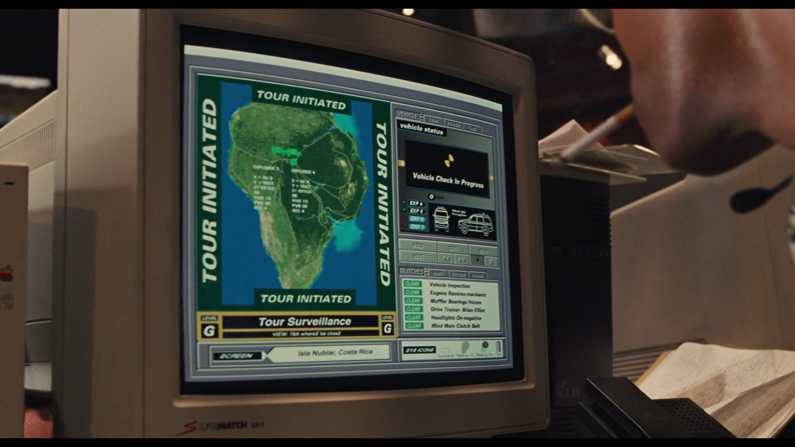

# Introduction

## What is this?

Nedryland is a collection of utilities and a build system for microservice architecture solutions.
Nedryland is built upon [Nix](https://nixos.org/nix/). Nix is a functional package manager for Unix
systems that promises reproducible and deterministic builds and build outputs. There is also
[nixpkgs](https://github.com/NixOS/nixpkgs), a collection of over 80 000 packages for the Nix
package manager that can be used to get dependencies for builds etc.

There is also [NixOS](https://nixos.org) which builds on the ideas of Nix to create a whole Linux
distribution where all configuration of the OS is also described in Nix and becomes 100%
deterministic and without side effects.

## What's up with the name?

Dennis Nedry is one of the main antagonists in the original Jurassic Park movie. His computer system
for orchestrating the park is called Nedryland JP. A screenshot of this magnificent system can be
seen above.
